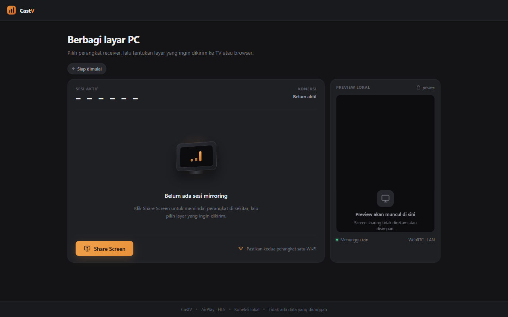
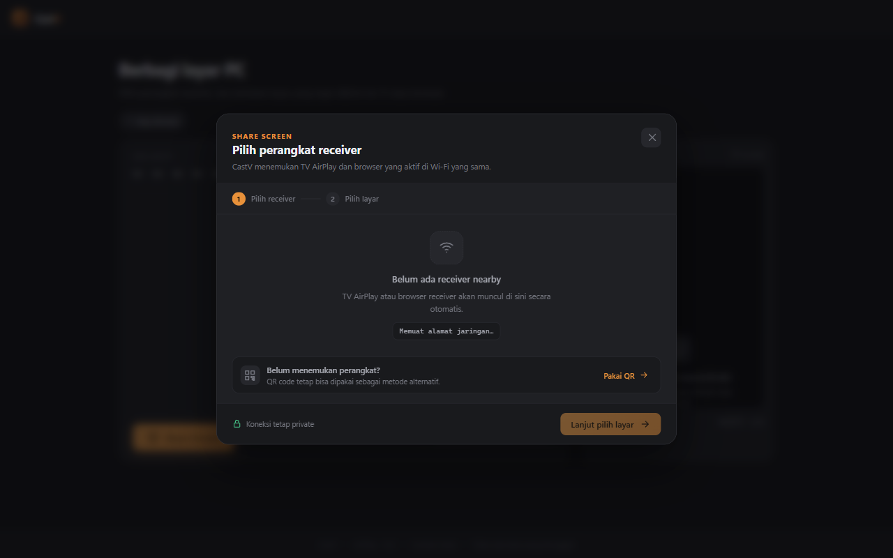
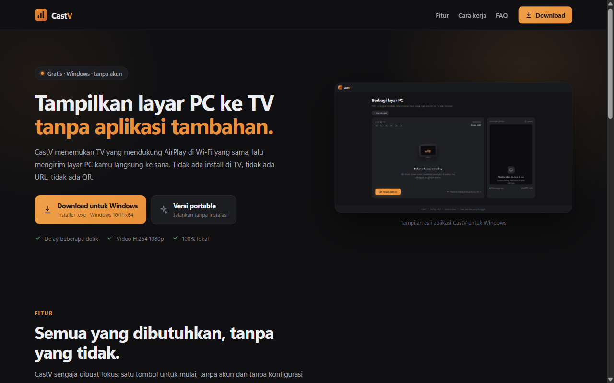

<div align="center">


# CastV

**Tampilkan layar PC ke TV tanpa aplikasi tambahan.**

Klik satu tombol, TV langsung terdeteksi, layar kamu flowing ke sana.
Tanpa install di TV. Tanpa URL. Tanpa QR.

[](https://github.com/sayid31/CastV/actions/workflows/ci.yml)
[](https://github.com/sayid31/CastV/releases/latest)
[](https://github.com/sayid31/CastV/releases)
[](https://github.com/sayid31/CastV/releases/latest)
[](#lisensi)
[](https://github.com/sayid31/CastV)

[🌐 Landing page](https://castv-woad.vercel.app) · [⬇️ Download](https://github.com/sayid31/CastV/releases/latest) · [🐛 Laporkan bug](https://github.com/sayid31/CastV/issues)

</div>

---

## 📸 Tampilan

<div align="center">
  
  <br /><br />
  
</div>

<div align="center">
  
  <br />
  <sub>Landing page publik CastV</sub>
</div>

---

## 🤔 Kenapa CastV?

Berbagi layar biasanya butuh salah satu dari ini:

- **install aplikasi** di TV
- **kirim URL** yang harus diketik manual
- **scan QR** dari HP
- **kabel**

CastV menghilangkan semua itu. TV yang mendukung AirPlay akan **muncul otomatis** di daftar perangkat begitu CastV dibuka — lewat mDNS, bukan karena kamu mengetik apa pun.

```text
Share Screen  →  pilih TV  →  pilih layar  →  streaming
```

---

## ✨ Fitur

| | Fitur |
|---|---|
| 📺 | **Tanpa aplikasi di TV** — cukup AirPlay bawaan |
| 🛰️ | **Auto-discovery** — TV & browser receiver terdeteksi via mDNS |
| 🎥 | **Pilihan sumber** — seluruh layar atau satu window aplikasi |
| 🔒 | **100% lokal** — tidak ada akun, tidak ada upload, tidak ada telemetry |
| 💻 | **Desktop app** — satu layar, satu tombol, tanpa menu berlapis |
| 🖥️ | **Web receiver** — HP, tablet, atau laptop kedua |
| 📦 | **Installer & portable** — file tunggal, tanpa dependency tambahan |
| 🆓 | **Gratis** — tidak ada biaya langganan |

---

## 🚀 Cara pakai

### Untuk pengguna akhir

1. Unduh installer dari [halaman release](https://github.com/sayid31/CastV/releases/latest)
2. Jalankan `CastV-latest-x64.exe` (atau `CastV-latest-portable.exe` tanpa instalasi)
3. Pastikan Windows Firewall mengizinkan CastV pada **Private network**
4. Klik **Share Screen** → pilih TV → pilih layar

> Installer belum code-signed, jadi Windows SmartScreen bisa menampilkan peringatan.
> Pilih **More info → Run anyway**.

### Untuk developers

```bash
git clone https://github.com/sayid31/CastV.git
cd CastV
npm install
npm run dev
```

`npm run dev` membuka Vite + jendela CastV di `app.html`.

| URL | Halaman |
|---|---|
| `http://127.0.0.1:5173/` | Landing page |
| `http://127.0.0.1:5173/app.html` | Desktop app |
| `http://127.0.0.1:5173/receiver.html` | Web receiver |

---

## 🏗️ Arsitektur

```text
┌─────────────────────── Laptop (sender) ────────────────────────┐
│                                                               │
│  Electron main process                                       │
│    ├── server HTTP + WebSocket  (port 43117)                  │
│    ├── mDNS discovery  (_airplay._tcp / _raop._tcp)          │
│    └── AirPlay /play client (HLS)                             │
│                                                               │
│  Renderer                                                     │
│    ├── getDisplayMedia() ──► WebCodecs H.264                  │
│    │        │                                                 │
│    │        ├──► fMP4 muxer ──► HLS segmenter ──┐            │
│    │        │                                    │            │
│    │        └──► RTCPeerConnection (WebRTC)     │            │
│    └────────────────────────────────────────────┼────────────┘
└─────────────────────────────────────────────────┼────────────┘
                                                  │
                    ┌─────────────────────────────┴──────────┐
                    ▼                                        ▼
            TV AirPlay (HLS)                      Browser receiver
            delay beberapa detik                 WebRTC langsung
            tanpa app di sisi TV                  HTTP LAN
```

### Tiga jalur output

| Jalur | Protokol | Kecepatan | Catatan |
|---|---|---|---|
| **TV AirPlay** | HLS / HTTP | delay beberapa detik | Video-only, 1080p30, ~5 Mbps |
| **Browser receiver** | WebRTC | sangat cepat | Butuh halaman receiver terbuka |
| **Android TV** | WebView + WebRTC | sangat cepat | Experimental, via `android-tv/` |

### Struktur repository

```text
app.html              Halaman desktop app
index.html            Landing page publik
receiver.html         Web receiver
electron/             Main process, AirPlay client, mDNS discovery
server/               HTTP + WebSocket + UDP discovery
src/lib/airplay/      Pipeline WebCodecs, muxer fMP4, segmenter HLS
android-tv/           Receiver native Android TV (eksperimental)
docs/                 Screenshot untuk README
```

---

## ⚠️ Batasan yang perlu diketahui

Jujur soal ini, karena lebih baik diketahui sekarang:

- **AirPlay HLS menambah delay beberapa detik.** Ini bukan real-time. Receiver browser (WebRTC) jauh lebih cepat.
- **Jalur AirPlay belum mengirim audio.** Hanya video. Dukungan audio direncanakan untuk rilis berikutnya.
- **TV harus mendukung AirPlay** (atau receiver native Android TV). Google Cast bawaan belum jadi jalur utama.
- **AirPlay 2 / HAP pairing belum didukung** — perangkat yang meminta pairing difilter dari daftar.
- **Belum code-signed**, jadi SmartScreen menampilkan peringatan.
- **Windows x64 saja** untuk installer resmi.
- **Wi-Fi dengan client isolation / VPN / firewall ketat** bisa menghalangi discovery.
- Preview lokal **tidak pernah direkam atau disimpan**.

---

## 🛠️ Scripts

| Script | Fungsi |
|---|---|
| `npm run dev` | Vite + Electron dalam mode pengembangan |
| `npm run build` | Typecheck + build ketiga halaman ke `dist/` (untuk Electron) |
| `npm run build:site` | Build landing page saja ke `dist-site/` (untuk Vercel) |
| `npm run dist` | Build installer Windows + portable |
| `npm run typecheck` | TypeScript check tanpa emit |
| `npm run web` | Jalankan server statis tanpa Electron |
| `npm run discover:cast` | Scan mDNS untuk mencari perangkat AirPlay/Cast |
| `npm run downloads:sync` | Salin installer ke `public/downloads/` untuk testing lokal |

---

## 🚢 Rilis

```bash
npm version 0.2.0
git push && git push --follow-tags
```

GitHub Actions otomatis: typecheck → build → package → GitHub Release.

Link download memakai nama asset stabil (`CastV-latest-x64.exe`), jadi
**tidak pernah rusak** dan landing page tidak perlu di-deploy ulang tiap rilis.

| Workflow | Trigger | Fungsi |
|---|---|---|
| `ci.yml` | push / PR | Typecheck, build, package installer |
| `release.yml` | tag `v*` | Build + publikasi GitHub Release |

---

## 🌐 Deploy

Website publik dibangun dengan konfigurasi terpisah (`vite.site.config.ts`)
via `npm run build:site`, yang **hanya** memuat landing page.

| Build | Config | Output | Isi |
|---|---|---|---|
| Aplikasi desktop | `vite.config.ts` | `dist/` | `index.html` + `app.html` + `receiver.html` |
| Website publik | `vite.site.config.ts` | `dist-site/` | `index.html` saja |

`app.html` dan `receiver.html` sengaja tidak ikut ke deployment, jadi website
benar-benar hanya berfungsi sebagai halaman pengenalan + unduhan — CastV
tidak bisa dijalankan lewat browser. Capture layar dan AirPlay membutuhkan
aplikasi desktop.

Konfigurasi Vercel ada di `vercel.json` (build `npm run build:site`, output
`dist-site`). File installer juga tidak ikut di-deploy karena limit Vercel
Hobby 100 MB — artefaknya ditaruh di GitHub Release.

---

## 📄 Lisensi

Belum ada lisensi yang ditetapkan. Semua hak cipta dilindungi sampai lisensi
dipilih. Kalau ingin kontribusi, buka issue dulu untuk berdiskusi.

---

<div align="center">

**CastV** — dibuat untuk presentasi yang tenang.

Made with ☕ using Electron, React, Vite, dan WebCodecs

</div>
